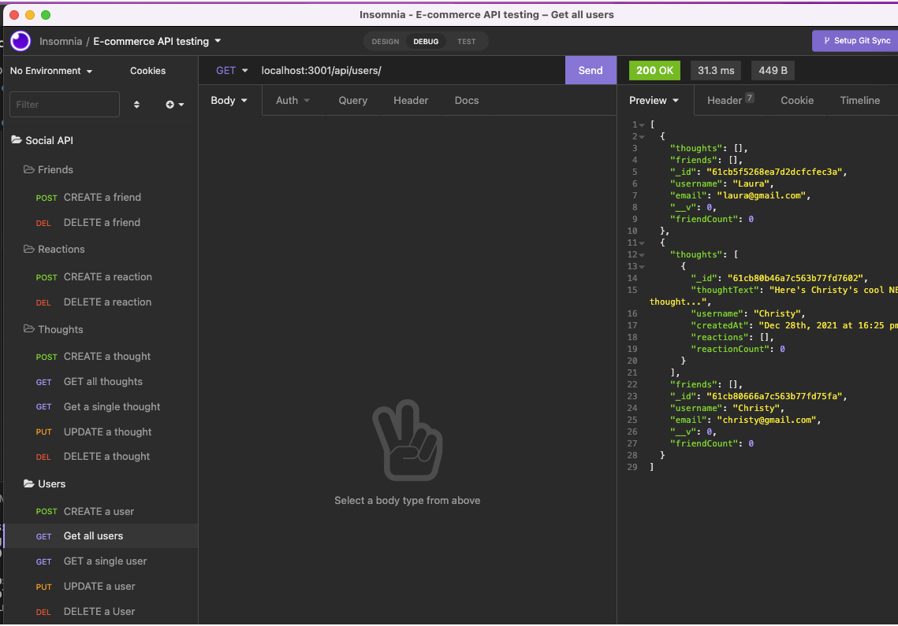

# NoSQL Social Network API 

  ## Table of Contents
  * [ Description ](#about)
  * [ Installation ](#installation)
  * [ Usage ](#usage)
  * [ Technologies ](#tech)
  * [ License ](#license)
  * [ Questions ](#questions)

  
  ## Description
  API end routes set up for a social network that allows a user to create an account, add and remove thoughts and reactions to thoughts.
  

  
  ## Installation
  run `git clone https://github.com/cshepscorp/nosql-social` to clone onto your machine\
  run `npm i` to install the appropriate packages for this application\
  `npm start` to run your server\
  You will need to have access to MongoDB on your machine.\
  Instructions for installing MongoDB can be found here: (https://docs.mongodb.com/manual/installation/)

  
  ## Usage
  Walkthrough Videos:\
  How to Start the server, adding and editing Users, adding and removing Friends and Thoughts. (https://watch.screencastify.com/v/qCjWnm6q5aXH73Jl4nhy) \
  How to Add Thoughts and Reactions and delete thoughts when a user is deleted. (https://watch.screencastify.com/v/EwUGRHho6VrCtnWSzFIW)

  
  ## Technologies
  JavaScript\
  Node.js\
  Express.js\
  MongoDB\
  Mongoose

  
  ## License
  MIT - A short and simple permissive license with conditions only requiring preservation of copyright and license notices. Licensed works, modifications, and larger works may be distributed under different terms and without source code. ([Read more about the MIT license](https://choosealicense.com/licenses/mit/))

  
  ## Questions
  Feel free to reach out to me with any additional questions
  * [Find me on GitHub](https://github.com/cshepscorp/)
  * Email me at: sheppard.christy@gmail.com
